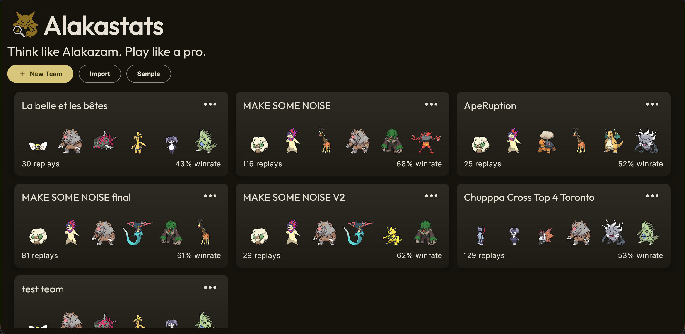
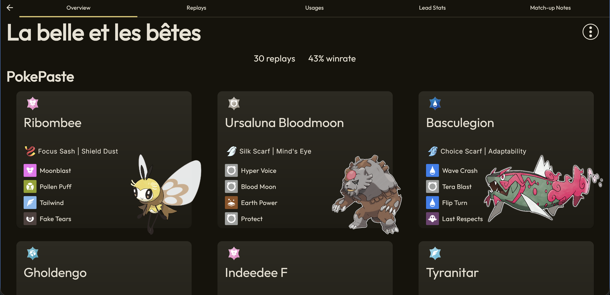
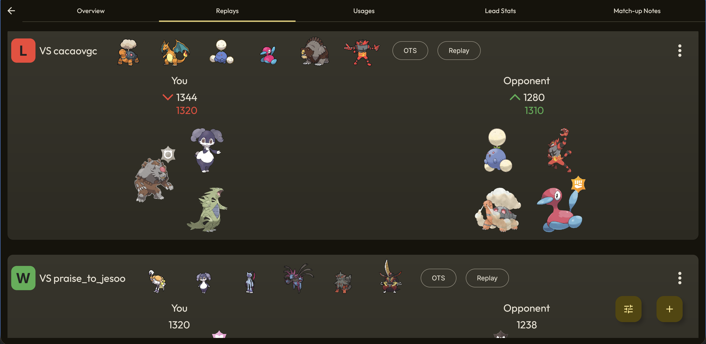
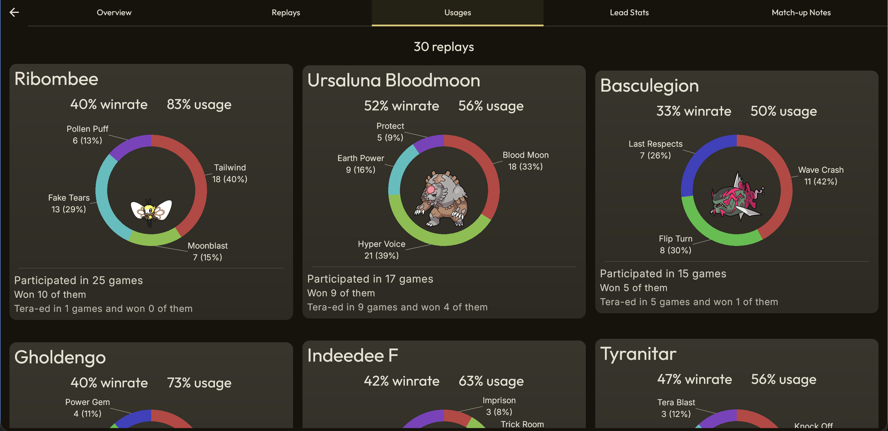
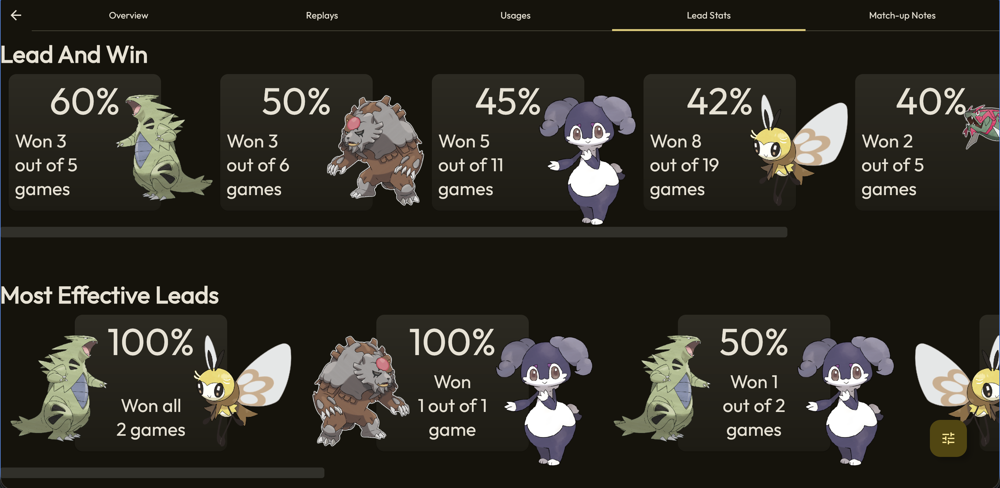
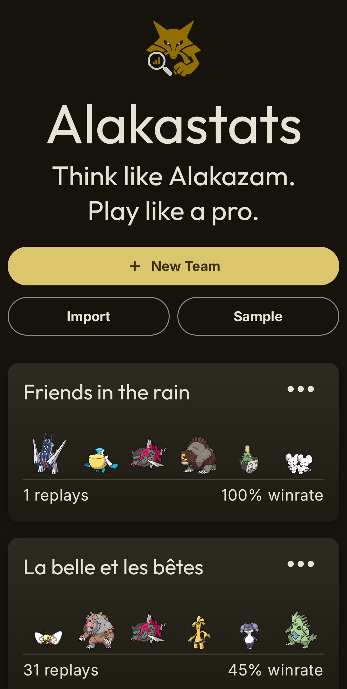
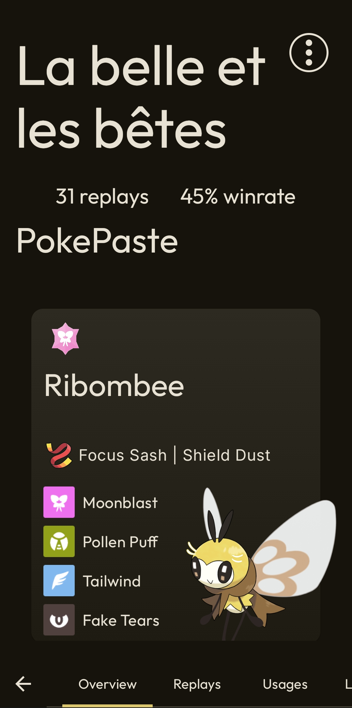
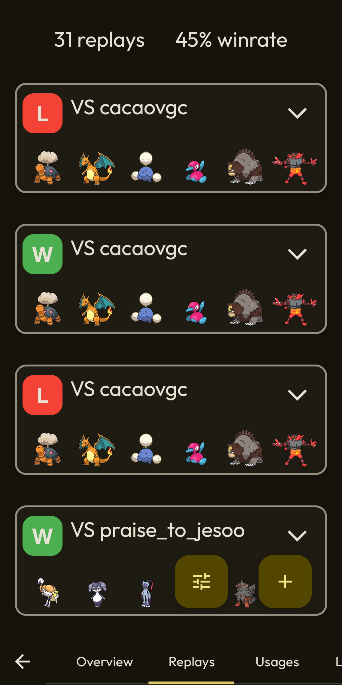
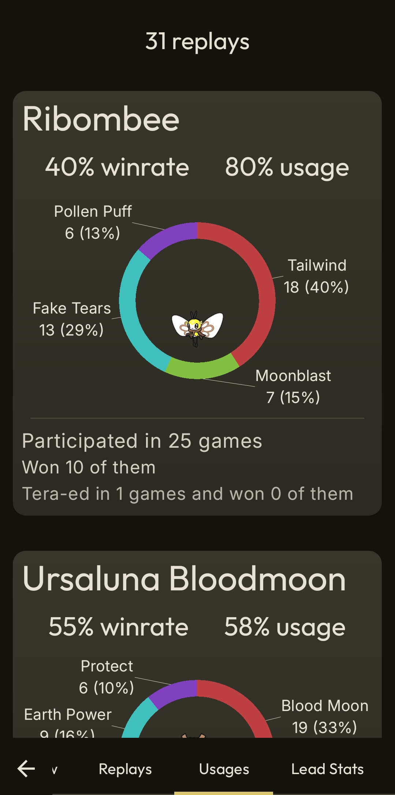
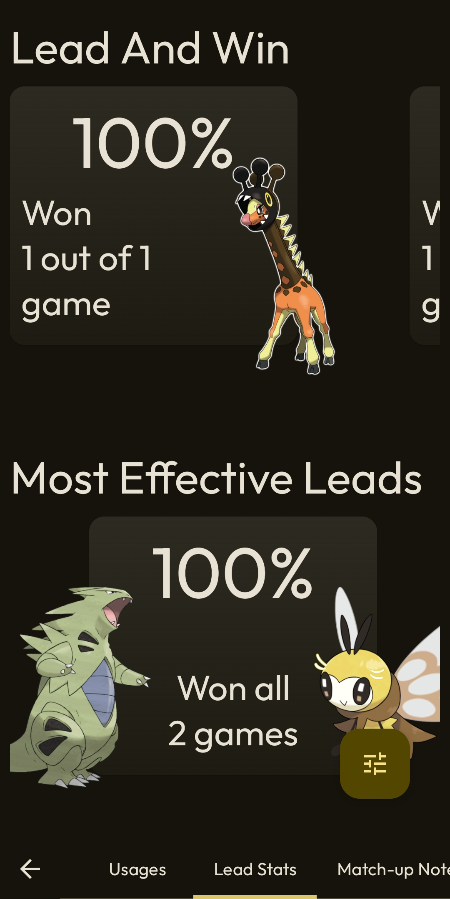

# Alakastats

> *“Think like Alakazam, play like pro.” — Alakastats*

**Alakastats** is a cross-platform app designed to analyze and visualize your **Pokémon VGC battles and replays**.  
It transforms your Showdown data into beautiful, interactive dashboards — helping you understand your playstyle, track your team performance, and improve your results over time.

## 🚀 Live demo

Check out the live web version here:  
👉 **[alakastats.app](https://tambapps.github.io/alakastats)** *(or your GitHub Pages URL)*

Android and iOS builds are coming soon.

## ✨ Overview

Understanding your games shouldn’t be complicated.  
Alakastats turns your [Pokemon Showdown](https://pokemonshowdown.com/) replays into clean, digestible insights:

- 📊 **Team analysis** — overall winrate, usage rate, and performance per Pokémon.
- 🧩 **Detailed sets** — moves, EVs, IVs, items, natures, and Tera types.
- 🔁 **Match history** — replay visualization with Elo tracking and lead pairing.
- 🎯 **Move & lead statistics** — per-Pokémon breakdowns for fine-tuned strategy.
- 💡 **Smooth UI** — elegant and optimized for both mobile and desktop.

## 🧬 Goal

> To make Alakastats the most enjoyable and insightful **Pokémon VGC tracker** for competitive players.

It’s designed to be:
- a **personal performance analyzer**,
- a **team-building assistant**,
- and a **visual showcase** of your battle data.

## 🧱 Tech stack

Built entirely with **Kotlin Multiplatform**, Alakastats delivers a native-feeling experience across every platform.

| Platform              | Stack                                                    |
|-----------------------|----------------------------------------------------------|
| 🖥️ **Web**           | Kotlin/Wasm + Compose Multiplatform                      |
| 📱 **Mobile**         | Android & iOS via Compose Multiplatform                  |
| ⚙️ **Shared core**    | Kotlin common module (replay parsing, stats computation) |
| 💾 **Storage**        | `SharedPreferences` (mobile) / `localStorage` (web)      |
| 🚀 **Build & deploy** | Gradle Multiplatform + GitHub Pages (web)                |

## 🖼️ Screenshots

### 🖥 Desktop



<br/>



<br/>




<br/>



<br/>



### 📱 Mobile


<p align="center">
  
  
  
</p>

<p align="center">
  
  
</p>

### Note to self

Sprites can be found with the following URLs patterns

```text
https://s3.pokeos.com/pokeos-uploads/assets/pokemon/home/768.png?v=3
https://s3.pokeos.com/pokeos-uploads/assets/pokemon/fallback/768-mega.png?v=3
```